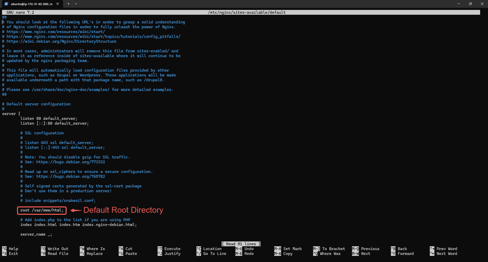

#  Project 1

 - #   Project Tasks

- Buy a domain name from a domain Registrar

-	Spin up an Ubuntu server & assign an elastic IP to it

-	SSH into the server and install Nginx

-	Download freely HTML website files(too plate) or use your personal code

-	Copy the website files to the Nginx website directory

-	Validate the website using the server IP address

-	In Route53, create an A record and add the Elastic IP

-	Using DNS verify the website setup

-	Install certbot and Request For an SSL/TLS Certificate

-	Validate the website SSL using the OpenSSL utility

# Task 1

- Go to https://ap.www.namecheap.com/, Click on Domain names

- Search for the name in the search bar:

Make payment for the Domain Name you want and a confirmation mail will be sent to your email.

# Task 2

Locate and click on EC2 within the AWS management console.

- Click on Launch Instance

-Name your instance and select the Ubuntu AMI.

-Click the Create new key pair button to generate a key pair for secure connection to your instance.

-Enter a Key pair name and click on Create key pair.

-Enable SSH, HTTP, and HTTPS access, then proceed to click Launch instance.

**Note**: For security reasons, it's recommended to restrict SSH access to your IP address only. However, for the purpose of this documentation, access has been granted from anywhere.

-Click on View all instances.

-Click on the created instance.

-Click on the Connect button.

-Copy the command provided under **SSH client**.

-Open a terminal in the directory where your **.pem** file was downloaded, paste the command and press Enter.

How to open a terminal in your downloads folder on windows:

- Navigate to your downloads folder (or the folder where you saved your .pem file), right-click, and choose Open in terminal.

How to open the Terminal in a specific folder where your EC2 instance key pair (.pem file) was downloaded on a Mac:

1. Using Finder:

- Open Finder and navigate to the folder where your **.pem** file is located (usually the Downloads folder).

- Right-click (or Control-click) on the folder.

- Select Services from the context menu, then choose New Terminal at Folder. (If you don’t see this option, you might need to enable it in System Preferences under Keyboard > Shortcuts > Services.)

2. Using Terminal with Drag and Drop:

- Open Terminal from Spotlight or Finder.
- In Finder, navigate to the folder where your **.pem** file is located.
- Drag the folder (or the **.pem** file) into the open Terminal window. This will automatically populate the Terminal with the path to that folder.
- If you dragged the folder, you can type **cd**  (with a space) before dropping it to change into that directory. For example: **cd** /Users/yourusername/Downloads/ (after dragging, it will show the complete path).

3. Using the **cd** Command:

- Open Terminal.
- Use the **cd** command to navigate to the folder where your .**pem** file is located. For example, if your key pair is in the Downloads folder, type:

 **cd ~/Downloads**

- Press Enter to execute the command.

- After following any of these methods, your Terminal will be opened in the directory where your **.pem** file is located, and you can use it to execute commands related to your EC2 instance.

# Create And Assign an Elastic IP

- Return to your AWS console and click on the menu icon to open the dashboard menu.

- Select Elastic IPs under Network & Security.

- Click on the Allocate Elastic IP address button.

- Keep the settings unchanged and proceed to click Allocate.

- Associate this Elastic IP address with your running instance.

- Select the instance you wish to associate with the elastic IP address, then click on Associate.

Note: The IP address for your instance has been updated to the elastic IP associated with it. Therefore, you will need to SSH into your instance again. Return to the connection page of your instance and copy the new command.

- Paste the command into your terminal and then press Enter. When prompted, type **"yes"** and press Enter to connect.

# Task 3

# Install Nginx and Setup Your Website
- Execute the following commands.

**sudo apt update**

**sudo apt upgrade**

**sudo apt install nginx**

- Start your Nginx server by running the **sudo systemctl start nginx** command, enable it to start on boot by executing **sudo systemctl enable nginx**, and then confirm if it's running with the **sudo systemctl status nginx** command.

- Go back to your EC2 dashboard and copy your Public IPv4 address.

- Visit your instances Public IPv4 address in a web browser to view the default Nginx startup page.

- Download your website template from your preferred website by navigating to the website, locating the template you want, and obtaining the download URL for the website.

# Task 4

-How to obtain the website template URL from tooplate.com:

- Visit Tooplate and select the website template you prefer.

- Scroll down to the download section, right-click to open the menu, and select Inspect from the options.

- Select the Network tab.

- Click the Download button.

- You’ll see the website zip folder appear. Hover your mouse or trackpad pointer over it and right-click again.

Note: Make sure you right-click on the zip folder, the one that says .zip. If it doesn't appear after clicking download, try clicking the download button again until it shows up, as shown in the picture.

- Hover your mouse cursor over Copy① and then click on Copy URL② from the list that appears on the right.

- Paste the URL into a notebook to use alongside the **curl** command when downloading the website content to your machine.

# Task 5

- Run this command
 **sudo curl -o /var/www/html/2130_waso_strategy.zip https://www.tooplate.com/zip-templates/2130_waso_strategy.zip** to download the websites file to your html directory.

 

 Note: The **curl** command is a utility for making HTTP requests via the command line. Here, it's utilized to retrieve a file from a specified URL. The **-o** flag designates the output file or destination. In this instance, it signifies that the downloaded file, named **"2130_waso_strategy.zip"**, should be stored in the **"/var/www/html/"** directory. The URL **https://www.tooplate.com/zip-templates/2130_waso_strategy.zip** is the source for downloading the file. Make sure to replace it with the URL of your own website template. Curl will retrieve the content located at this URL.

- To install the unzip tool, run the following command: **sudo apt install unzip**.

- Navigate to the web server directory by running the following command: **cd /var/www/html**.

Unzip the contents of your website by running sudo unzip **2130_waso_strategy.zip**.
Note: Replace **2130_waso_strategy.zip** with the actual name of your website zip file. For example, mine is **2130_waso_strategy.zip** so i ran sudo unzip **2130_waso_strategy.zip**.

Update your nginx configuration by running the command **sudo nano /etc/nginx/sites-available/default**. Then, edit the **root** directive within your server block to point to the directory where your downloaded website content is stored.

- Restart Nginx to apply the changes by running: **sudo systemctl restart nginx**.

- Open a web browser and go to your **Public IPv4 address/Elastic IP address** to confirm that your website is working as expected.

# Task 6

# Create An A Record

To make your website accessible via your domain name rather than the IP address, you'll need to set up a DNS record. I did this by buying my domain from Namecheap and then moving hosting to AWS Route 53, where I set up an A record.

**Note**: Your domain registrar's interface might look different, but they all follow a similar basic layout.

- On the website click on Domain List.

- Click on the Manage button.

- Go back to your AWS console, search for Route 53①, and then choose Route 53② from the list of services shown.

- Click on Get started.

- Select Create hosted zones① and click on Get started②.

- Enter your Domain name①, choose Public hosted zone② and then click on Create hosted zone③.

- Select the created hosted zone① and copy the assigned Values②.

- Go back to your domain registrar and select Custom DNS within the NAMESERVERS section.

- Paste the values you copied from Route 53 into the appropriate fields, then click the checkmark symbol to save the changes.

- Head back to your AWS console and click on Create record.

- Your A record has been successfully created.

- Click on create record again, to create the record for your sub domain.

- Input the Record name(www➀), paste your IP address➁, and then click on Create records➂.

**Note**: Make sure to create DNS records for both your root domain and subdomain. This involves setting up an A record for the root domain **(e.g., example.com)** and another A record for the subdomain **(e.g., www.example.com)**. These records will direct traffic to your server's IP address, ensuring that both your main site and any subdomains are accessible.

- Open your terminal and run **sudo nano /etc/nginx/sites-available/default** to edit your settings. Enter your domain and subdomain names, then save the changes.

- Restart your nginx server by running the **sudo systemctl restart nginx** command.

- Go to your domain name in a web browser to verify that your website is accessible.

**Note**: You may notice the sign that says Not secure. Next, you'll use certbot to obtain the SSL certificate necessary to enable HTTPS on your site.

# Task 7
# Install certbot and Request For an SSL/TLS Certificate
- Install certbot by executing the following commands: **sudo apt update sudo apt install certbot python3-certbot-nginx**

- Execute the **sudo certbot --nginx** command to request your certificate. Follow the instructions provided by certbot and select the domain name for which you would like to activate HTTPS.

- Verify the website's SSL using the OpenSSL utility with the command: **openssl s_client -connect Cheapdomains.store:443**

- Visit https://<domain name> to view your website.

# The End Of Project 1
