# Project 2

# Setup Multiple Static Websites on a Single Server Using Nginx Virtual Hosts

**Project Tasks**

1	Install and configure Nignx on a server

2	Create two website directories with two different website templates.

3	Create two subdomains

4	Add the IP of the server as A record to the two subdomains.

5	Configure the Virtual host to point two subdomains to two different website directories.

6	Validate the setup by accessing the subdomains.

7	Create a certbot SSL certificate for the root Domain.

8	Configure certbot on Nginx for two websites.

9	Validate the subdomain websites’ SSL using OpenSSL utility.

# Checklist
 - Spin up a Ubuntu server & assign an elastic IP to it.
 -  SSH into the server and install and configure Nignx on a server.
 - Create two website directories with two different website templates.
 - Create two subdomains
 - Add the IP of the server as A record to the two subdomains.
 - Configure the Virtual host to point two subdomains to two different website directories.
-  Validate the setup by accessing the subdomains.
 - Create a certbot SSL certificate for the root Domain.
 - Configure certbot on Nginx for the two websites.
 - Validate the subdomain websites’ SSL using OpenSSL utility.

 # Documentation

 - Spin up an Ubuntu server, as well as creating and associating an elastic IP address with your server, associate it to your instance.

# Install Nginx and Setup Your Website 

Execute the following commands.
- **sudo apt update**

- **sudo apt upgrade**

- **sudo apt install nginx**

- Start your Nginx server by running the **sudo systemctl start nginx** command, enable it to start on boot by executing **sudo systemctl enable nginx**, and then confirm if it's running with the **sudo systemctl status nginx** command.

- Visit your instances IP address in a web browser to view the default Nginx startup page.

- Download your website template from your preferred website by navigating to the website, locating the template you want.

- Right click and select Inspect from the drop down menu.

- Click on the **Network tab** and then click **Download** button.

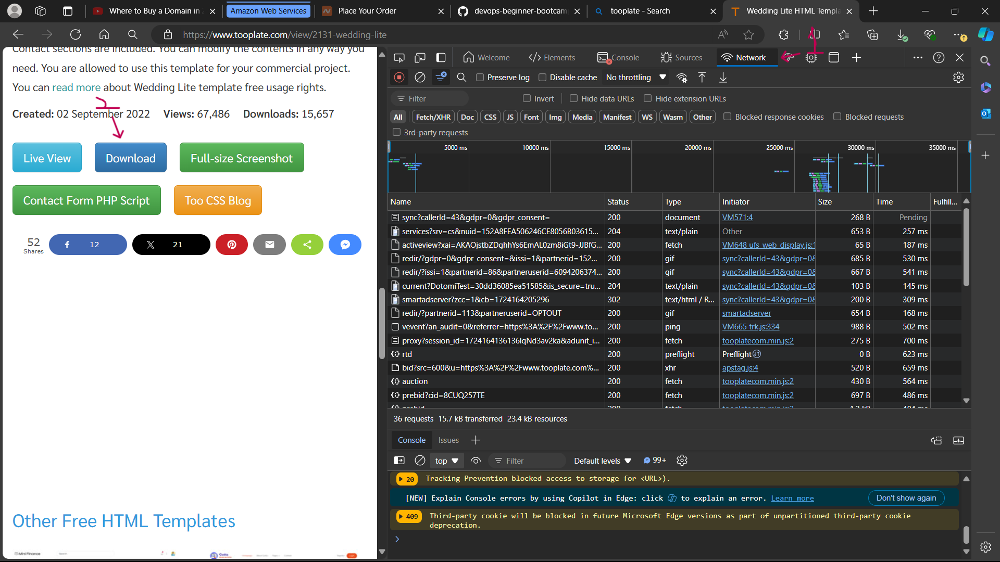

- Right click on the website name, select Copy and click on Copy link address.

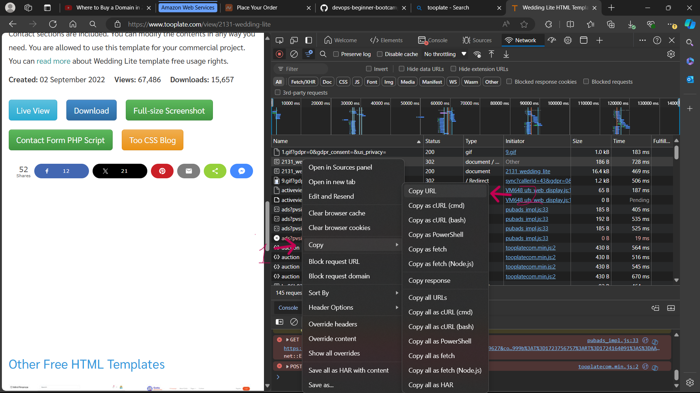

- To install the unzip tool, run the following command: **sudo apt install unzip**.

- Execute the command to download and unzip your website files **sudo curl -o /var/www/html/2131_wedding_lite.zip https://www.tooplate.com/zip-templates/2131_wedding_lite && sudo unzip -d /var/www/html/ /var/www/html/2131_wedding_lite.zip && sudo rm -f /var/www/html/2131_wedding_lite.zip**.

- This is an explanation of the command:

- The command **sudo curl -o /var/www/html/2131_wedding_lite.zip https://www.tooplate.com/zip-templates/2131_wedding_lite.zip && sudo unzip -d /var/www/html/ /var/www/html/2131_wedding_lite.zip && sudo rm -f /var/www/html/2131_wedding_lite.zip** performs a series of actions to download, unzip, and clean up a website template file. Here’s a breakdown of each part of the command:

1. **sudo curl -o /var/www/html/2131_wedding_lite.zip https://www.tooplate.com/zip-templates/2131_wedding_lite.zip**:

- **sudo**: Runs the command with superuser (root) privileges.

- **curl -o /var/www/html/2131_wedding_lite.zip**: Downloads the file from the specified URL (**https://www.tooplate.com/zip-templates/2131_wedding_lite.zip**) and saves it as **2131_wedding_lite.zip** in the **/var/www/html** directory.

2. **&&**: Logical AND operator, which ensures that the next command runs only if the previous command succeeds.

3. **sudo unzip -d /var/www/html/ /var/www/html/2131_wedding_lite.zip**:

- **sudo**: Runs the command with superuser (root) privileges.

- **unzip -d /var/www/html/**: Extracts the contents of the zip file into the **/var/www/html/** directory.

- **/var/www/html/2131_wedding_lite.zip**: Specifies the path to the zip file to be unzipped.

4. **&&**: Logical AND operator, which ensures that the next command runs only if the previous command succeeds.

5. **sudo rm -f /var/www/html/2131_wedding_lite.zip**:

- **sudo**: Runs the command with superuser (root) privileges.
- **rm -f**: Removes (deletes) the specified file forcefully (without prompting for confirmation).

- **/var/www/html/2131_wedding_lite.zip**: Specifies the path to the zip file to be deleted.

- In summary, this command downloads the website template file, extracts its contents to the web server directory, and then deletes the downloaded zip file to clean up the directory.

- Download the 2nd website template by running the following command:

**sudo curl -o /var/www/html/2135_mini_finance.zip https://www.tooplate.com/zip-templates/2135_mini_finance.zip && sudo unzip -d /var/www/html/ /var/www/html/2135_mini_finance.zip && sudo rm -f /var/www/html/2135_mini_finance.zip**

**Note**: Replace the placeholders in the code with your own website URL. For example, substitute https://www.tooplate.com/zip-templates/2135_mini_finance.zip with your chosen URL, and change 2135_mini_finance.zip accordingly.

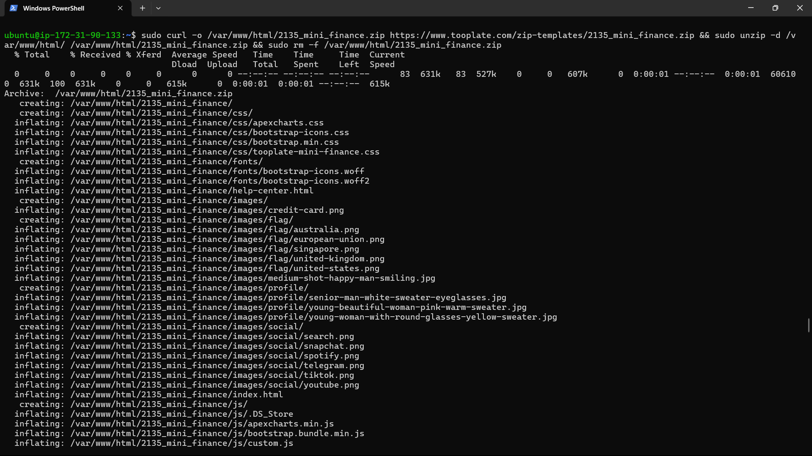

- To set up your website's configuration, start by creating a new file in the Nginx sites-available directory. Use the following command to open a blank file in a text editor: **sudo nano /etc/nginx/sites-available/wedding**

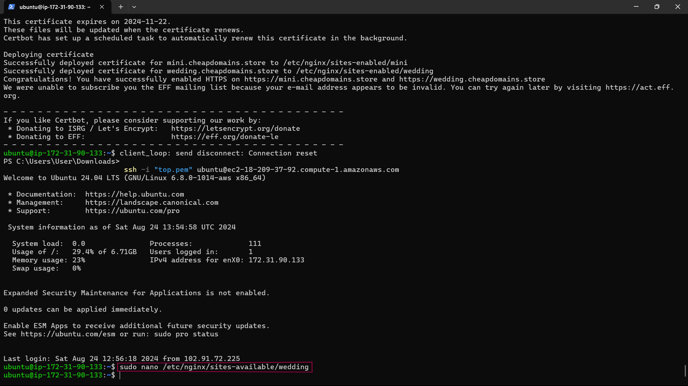

- Copy and paste the following code into the open text editor.

server {
    listen 80;
    server_name example.com www.example.com;

    root /var/www/html/example.com;
    index index.html;

    **location / {
        try_files $uri $uri/ =404;
    }
}

- Edit the **root** directive within your server block to point to the directory where your downloaded website content is stored.

- Configure your second website by creating a new file in the Nginx sites-available directory with the following command: **sudo nano /etc/nginx/sites-available/health**.

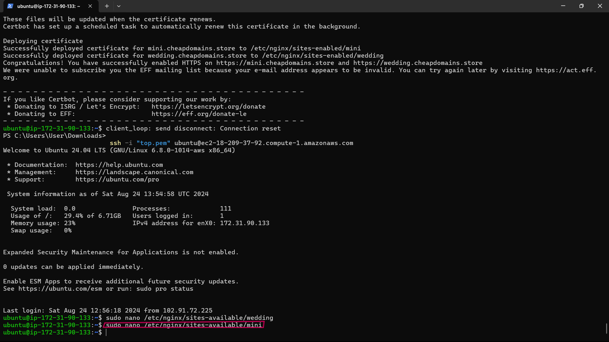

- Copy and paste the following code into the open text editor.

server {
    listen 80;
    server_name placeholder.com www.placeholder.com;

    root /var/www/html/placeholder.com;
    index index.html;

    location / {
        try_files $uri $uri/ =404;
    }
}

- Edit the **root** directive within your server block to point to the directory where your downloaded website content is stored.

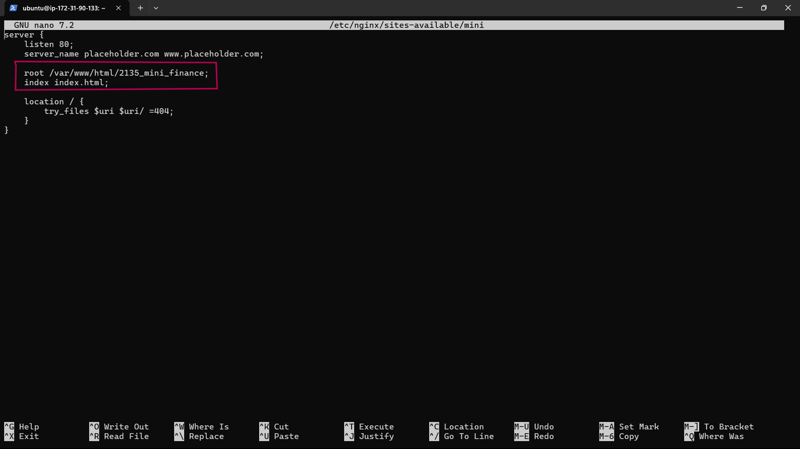

- Create a symbolic link for both websites by running the following command.

**sudo ln -s /etc/nginx/sites-available/wedding/etc/nginx/sites-enabled/**

 **sudo ln -s /etc/nginx/sites-available/mini /etc/nginx/sites-enabled/**

 

 - Run the **sudo nginx -t** command to check the syntax of the Nginx configuration file.

- Delete the default files in the sites-available and sites-enabled directories by executing the following commands:

**sudo rm /etc/nginx/sites-available/default**
**sudo rm /etc/nginx/sites-enabled/default**

- Restart the Nginx server by executing the following command: **sudo systemctl restart nginx.**

# Create An A Record

- To make your website accessible via your domain name rather than the IP address, you'll need to set up a DNS record. I did this by buying my domain from Namecheap and then moving hosting to AWS Route 53, where I set up an A record.

**Note**: Visit Project1 for instructions on how to create a hosted zone.

- In route 53, select the domain name and click on Create record.

- Paste your IP address① and then click on Create records②.

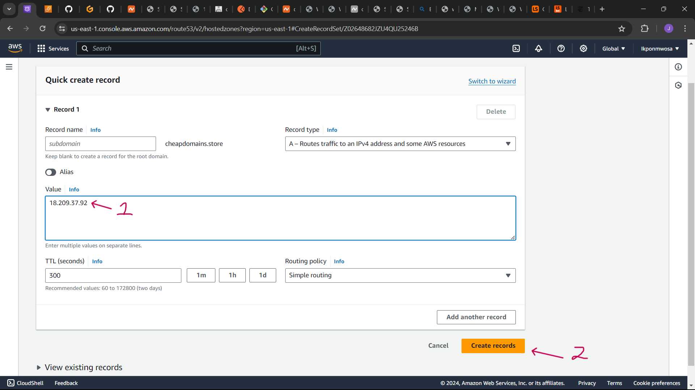

- Click on Create record again, to create the record for your sub domain.

- Input the Record name①, paste your IP address② and then click on Create records③.

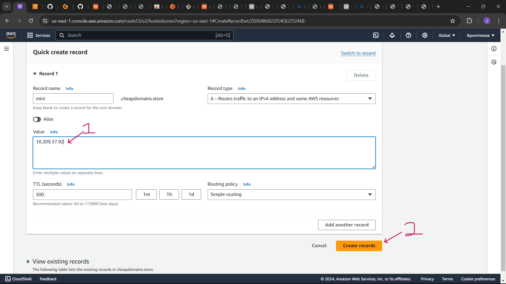

- Repeat the same process while creating your second subdomain record, and confirm that they both exist in the records list.

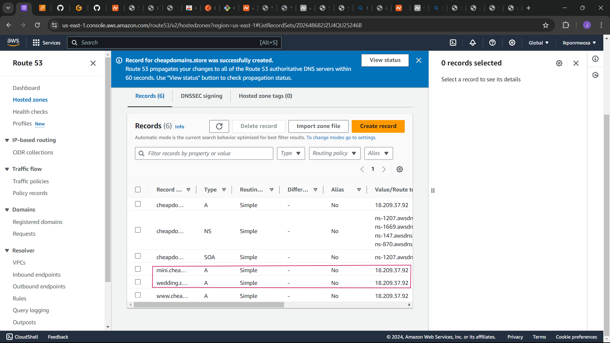

- Open your terminal and run **sudo nano /etc/nginx/sites-available/wedding** to edit your settings. Enter the name of your domain and then save your settings.

- Restart your nginx server by running the **sudo systemctl restart nginx** command.

- Go to your domain name in a web browser to verify that your website is accessible.

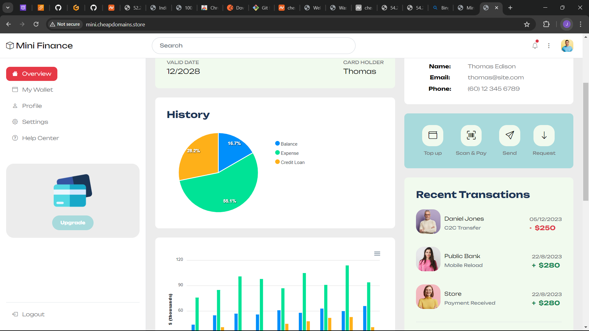

**Note**: You may notice the sign that says Not secure. Next, you'll use certbot to obtain the SSL certificate necessary to enable HTTPS on your site.

# Install certbot and Request For an SSL/TLS Certificate

- Install certbot by executing the following commands: **sudo apt update** **sudo apt install python3-certbot-nginx** **sudo certbot --nginx**

- Execute the **sudo certbot --nginx** command to request your certificate. Follow the instructions provided by certbot and select the domain name for which you would like to activate HTTPS.

- Verify the website's SSL using the OpenSSL utility with the command: openssl s_client -connect wedding.cheapdomains.store:443

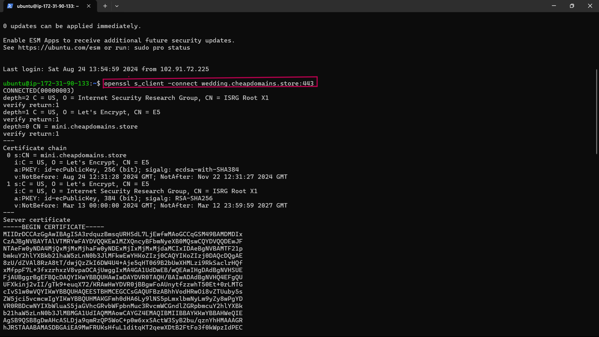

- Visit https://<domain name> to view your websites.

# The End of Project 2
