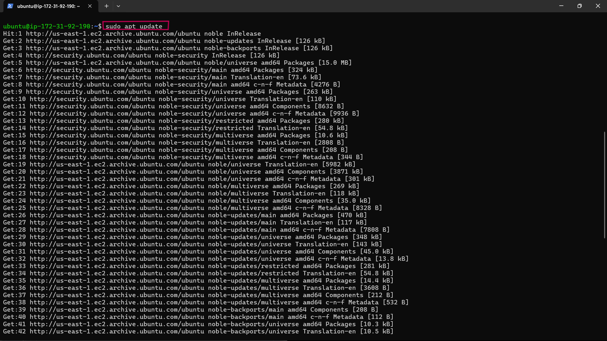

# Setting Up A WordPress Website Using LAMP Stack

# Checklist

 Task 1: Deploy an Ubuntu Server
 
 Task 2: Set up your LAMP stack on the server
 
 Task 3: Configure the wordpress Application
 
 Task 4: Map the IP address to the DNS A record

 Task 5: Validate the WordPress website setup by accessing the web address.

 # Documentation

 - After spinning up an Ubuntu swerver

 - Set an inbound rule for MYSQL in your security group. Click on Security and select the Security group.

 

 - Click on Edit inbound rules.

 

 - Click on Add rule.

 

 - Click on Custom TCP and select MySQL/Aurora.


- Enter the IP address then you will want to allow access and click Save rules.


- Open your terminal and connect to your Ubuntu server via SSH.

# Install Apache

- To install Apache, run the following commands in your terminal.

**sudo apt update**



**sudo apt install apache2**


-To enable Apache to start on boot, execute **sudo systemctl enable apache2**, and then verify its status with the **sudo systemctl status apache2** command.


- Now, let's check if our server is running and accessible both locally and from the Internet by executing the following command: **curl http://localhost:80**


- After this it's time to test how our Apache HTTP server responds to requests from the Internet.

- Copy your public IPv4 address from your EC2 dashboard.


- Open a web browser of your choice and try accessing the following URL: **http://Public-IP-Address:80**.


- If the installation was successful, it should look like this page.


# Install MYSQL

- To install this software using 'apt', run the command **sudo apt install mysql-server**. When prompted, confirm the installation by typing 'Y' and then pressing ENTER.


- After the installation is complete, log in to the MySQL console by typing: **sudo mysql**.

- Run the following command to set the password for the root user with the MySQL native password authentication method: **ALTER USER 'root'@'localhost' IDENTIFIED WITH mysql_native_password BY 'pass'**;. Exit the MySQL shell when you're done by typing **exit**.


- Start the interactive script by running: sudo mysql_secure_installation. Answer y for yes, or any other key to continue without enabling specific options.

- Set your password validation policy level.


**Note**: I set my password validation policy level to 0 because I don't require much security, because I will be terminating all resources after this project. But it's been advised to use the strongest level, which is 2.

- Enable MySQL to start on boot by executing **sudo systemctl enable mysql**, and then confirm its status with the **sudo systemctl status mysql** command.


# Install PHP

- Install PHP along with required extensions by running the following script: **sudo apt install php-curl php-gd php-mbstring php-xml php-xmlrpc php-soap php-intl php-zip**.


**sudo apt install php libapache2-mod-php php-mysql**


- Confirm the downloaded PHP version by running **php -v.**

# Creating A Virtual Host For Your Website Using Apache

- Create the directory for Projectlamp using the 'mkdir' command as follows: **sudo mkdir /var/www/projectlamp** and assign ownership of the directory to our current system user using: **sudo chown -R $USER:$USER /var/www/projectlamp.**


- Create and open a new configuration file in Apache's sites-available directory using your preferred command-line editor: sudo vi /etc/apache2/sites-available/projectlamp.conf.

- Creating this will produce a new blank file. Paste the configuration text provided below into it:

```
<VirtualHost *:80>

ServerName projectlamp

ServerAlias www.projectlamp

ServerAdmin webmaster@localhost

DocumentRoot /var/www/projectlamp

ErrorLog ${APACHE_LOG_DIR}/error.log

CustomLog ${APACHE_LOG_DIR}/access.log combined

</VirtualHost>
```


- Save your changes by pressing the **Esc** key, then type **:wq** and press **Enter.**


- Run the ls command **sudo ls /etc/apache2/sites-available** to show the new file in the sites-available directory.


- We can now enable the new virtual host using the a2ensite command: **sudo a2ensite projectlamp.**


- To disable Apache's default website, use the a2dissite command. Type: **sudo a2dissite 000-default.**


- To ensure your configuration file doesn’t contain syntax errors, run: **sudo apache2ctl configtest**. You should see **"Syntax OK"** in the output if your configuration is correct.


-  run: **sudo systemctl reload apache2**. This will reload Apache for the changes to take effect.

**Note**: The new website is now active, but the web root /var/www/projectlamp is still empty. Let's create an index.html file in that location to test that the virtual host works as expected.

- To create the index.html file with the content "Hey LAMP from ik" in the /var/www/projectlamp directory, use the following command: **sudo echo 'Hey LAMP from ik' > /var/www/projectlamp/index.html.**


- Now, let's open our web browser and try to access our website using the IP address:
**http://EC2-Public-IP-Address:80**


- To Remove the index.html file by running the following command: **sudo rm /var/www/projectlamp/index.html** 

# Enable PHP On The Website

The default DirectoryIndex settings is on Apache, a file named index.html will always come first over an index.php file. To change the precedence of index files (such as index.php over index.html) in Apache, you'll need to edit the dir.conf file. This is how you can do it:

- Edit the dir.conf file using a text editor: **sudo nano /etc/apache2/mods-enabled/dir.conf**

- Look for the DirectoryIndex directive within this file. It typically looks like this:

```
<IfModule mod_dir.c>
    DirectoryIndex index.html index.cgi index.pl index.php index.xhtml index.htm
</IfModule>
```

- To prioritize index.php over index.html, move index.php to the beginning of the list, like this:

```
<IfModule mod_dir.c>
    DirectoryIndex index.php index.html index.cgi index.pl index.xhtml index.htm
</IfModule>
```


- press **ctrl + o** on the keyboard to edit, then **ctrl + x** to save and exit.

-  Reload Apache for the changes to take effect: sudo systemctl reload apache2.


Now, Apache will prioritize index.php over index.html when both files exist in the same directory.

- To create a new file named index.php inside your custom web root folder (/var/www/projectlamp), you can use the following command to open it in the nano text editor: **nano /var/www/projectlamp/index.php.**

- This will create a new file. Copy and paste the following PHP code into the new file:

```
<?php

phpinfo();
```


- After saving and closing the file, go back to your web browser and refresh the page. It should look something like this:


 After verifying the relevant information about your PHP server through that page, it's recommended to remove the file you created, as it contains sensitive information about your PHP environment and your Ubuntu server. You can use the rm command to do so: **sudo rm /var/www/projectlamp/index.php**.

 # Install Wordpress

After setting up the LAMP environment, we can start installing WordPress. First, we'll download the WordPress installation files and place them in the default web server root directory: /var/www/html.

- Navigate to the directory using the cd command **cd /var/www/html**, and then download the WordPress installation files using the following command: **sudo wget -c http://wordpress.org/latest.tar.gz.**


- Extract the files from the downloaded WordPress archive using the command: **sudo tar -xzvf latest.tar.gz.**


- Run the command **ls -l** to confirm the existence of the wordpress directory in the current location **(/var/www/html)**.


- Check the user running your web server with the command: **ps aux | grep apache | grep -v grep.**


This command filters processes related to Apache (apache2 on Ubuntu) and displays information about the user running those processes.

- Grant ownership of the WordPress directory and its files to the web server user (www-data) by running the command: **sudo chown -R www-data:www-data /var/www/html/wordpress.**


# Create a Database For Wordpress

- Access your MySQL root account with the following command: **sudo mysql -u root -p**. Enter the password you set earlier when prompted.


-To create a separate database named wp_db for WordPress to manage, execute the following command in the MySQL prompt: **CREATE DATABASE wp_db;**


**Note**: This command allows you to create a new database (wp_db) within your MySQL environment. Feel free to name it as you prefer.

- To access the new database, you can create a MySQL user account with a strong password using the following command: **CREATE USER ik@localhost IDENTIFIED BY 'wp-password';**


**Note**: Also if wanted Replace 'wp-password' with your preferred strong password for the MySQL user account.

- To grant your created user (ik@localhost) all privileges needed to work with the wp_db database in MySQL, use the following commands:

```
GRANT ALL PRIVILEGES ON wp_db.* TO ik@localhost;
FLUSH PRIVILEGES;
```


- Type **exit** to exit the MySQL shell.


- Grant executable permissions recursively (-R) to the wordpress folder using the following command: **sudo chmod -R 777 wordpress/**


- Change into the WordPress directory by running the command: **cd wordpress.**


# Configure Wordpress

After you've established a database for WordPress, the next step is setting up and configuring WordPress itself. To begin, you'll need to create a configuration file tailored for WordPress.

- Rename the sample WordPress configuration file with the command: **mv wp-config-sample.php wp-config.php.**

- Edit the **wp-config.php** file using the command: **sudo nano wp-config.php.**


Update the database settings in the **wp-config.php** file by replacing placeholders like database_name_here, username_here, and password_here with your actual database details.


- Modify the configuration file projectlamp.conf: **sudo nano /etc/apache2/sites-available/projectlamp.conf** to update the document root to the directory where your WordPress installation is located.


- After updating the document root to /var/www/html directory in your editor, save the changes and exit.


- Reload Apache for the changes to take effect: sudo systemctl reload apache2.

Once these steps have been completed , you can access your WordPress page to complete the installation. Open your web browser and go to **http://EC2 IP/wordpress/.** This will lead you to the WordPress setup wizard where you can finalize the installation process.

**Note**: Replace with the IP address of your EC2 instance when accessing your WordPress page.

- Select your preferred language and then click on Continue to proceed.


 Enter the required information and click on Install WordPress once you have finished.

Site Title①: Enter the name of your WordPress website. It's recommended to use your domain name for better optimization.

Username②: Choose a username for logging into WordPress.

Password③: Set a secure password to protect your WordPress account.

Your email④: Provide your email address to receive updates and notifications.

Search engine visibility⑤: You can leave this box unchecked to prevent search engines from indexing your site until it's ready.


- WordPress has been successfully installed. Now log in to your admin dashboard using the previously set up information by clicking the Log In button.


- Enter your username and password, then click Log In to access your WordPress admin dashboard.


- Once successfully logged in, you will be greeted by the WordPress dashboard page.


# Create An A Record

To make your website accessible via your domain name rather than the IP address, you'll need to set up a DNS record. I did this by buying my domain from Namecheap and then moving hosting to AWS Route 53, where I set up an A record.

- Point your domain's DNS records to the IP addresses of your Apache load balancer server.

- In route 53, click on Create record.


- Paste your IP address➀ and then click on Create records➁ to create the root domain.


- Click on Create record again, to create the record for your sub domain.


- Paste your IP address, input the Record name(www) and then click on Create records.


- To update your Apache configuration file in the sites-available directory to point to your domain name, use the command: **sudo nano /etc/apache2/sites-available/projectlamp.conf.**

- Ensure that the server settings in your Apache configuration point to your domain name, and that the document root accurately points to your WordPress directory. Once you've made these adjustments, save the changes and exit the editor.

```
<VirtualHost *:80>
    ServerName <Your root domain name>
    ServerAlias <Your sub domain name>
    ServerAdmin webmaster@<Your root domain name>

    DocumentRoot /var/www/html/wordpress

    <Directory /var/www/html/wordpress>
        Options Indexes FollowSymLinks
       # AllowOverride All
        Require all granted
    </Directory>

    ErrorLog ${APACHE_LOG_DIR}/error.log
    CustomLog ${APACHE_LOG_DIR}/access.log combined
</VirtualHost>

```


- To update your **wp-config.php** file with DNS settings, use the following command: **sudo nano wp-config.php** and add these lines to the file:

```
/** MY DNS SETTINGS */
define('WP_HOME', 'http://<domain name>');

define('WP_SITEURL', 'http://<domain name>');

```

- Replace http://domain name with your actual domain name. Save the changes and exit the editor.


- Reload your Apache server to apply the changes with the command: **sudo systemctl reload apache2**, After reloading, visit your website at **http://domain name** to view your WordPress site. Replace with your actual domain name.


- To log in to your WordPress admin portal, visit **http://domain name/wp-admin**, Enter your username and password, then click on log In. Replace with your actual domain name.


- Now that your WordPress site is successfully configured to use your domain name, the next step is to secure it by requesting an SSL/TLS certificate.


# Install certbot and Request For an SSL/TLS Certificate

- Install certbot by executing the following commands: **sudo apt update sudo apt install certbot python3-certbot-apache**


- Run the command **sudo certbot --apache** to request your SSL/TLS certificate. Follow the instructions provided by Certbot to select the domain name for which you want to enable HTTPS.

- You should receive a message confirming that the certificate has been successfully obtained.


- Visit your website to confirm, and you'll notice that the "not secure" warning no longer appears, indicating that your site is now secure with HTTPS.


# The End Of Project 4
