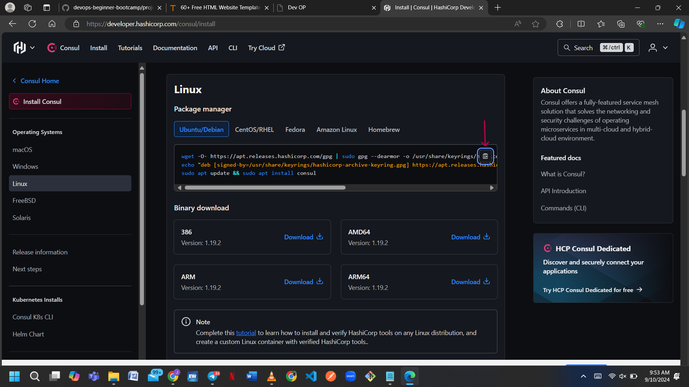
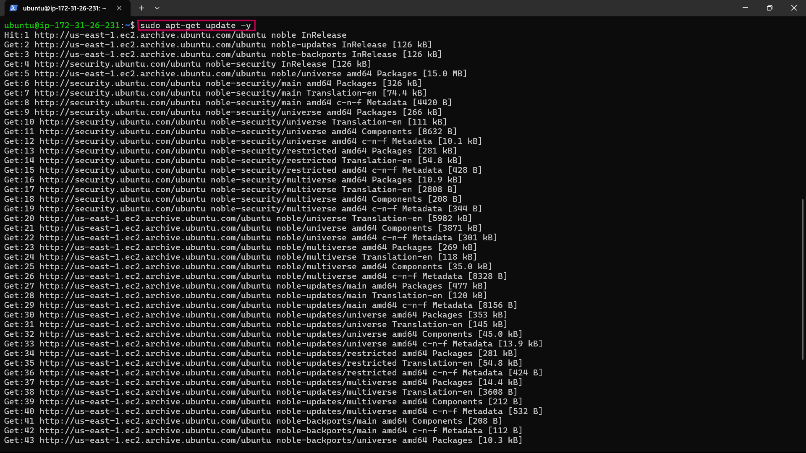
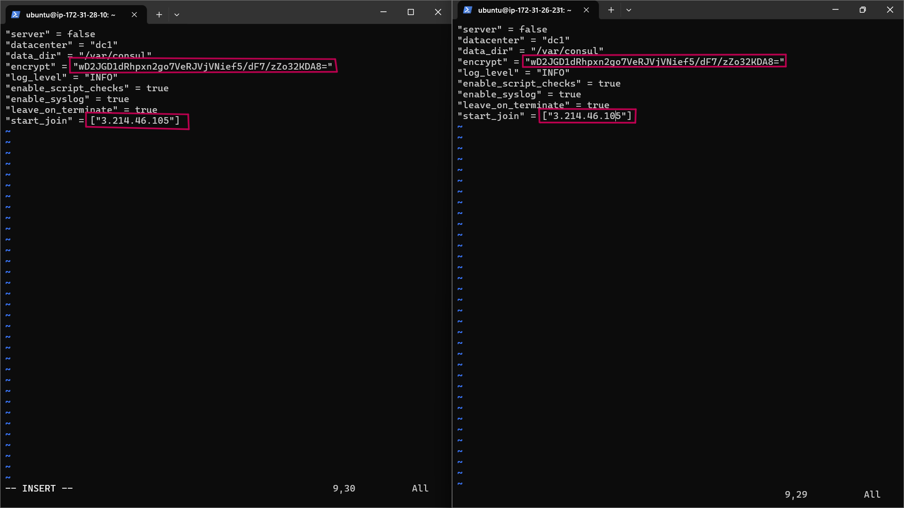
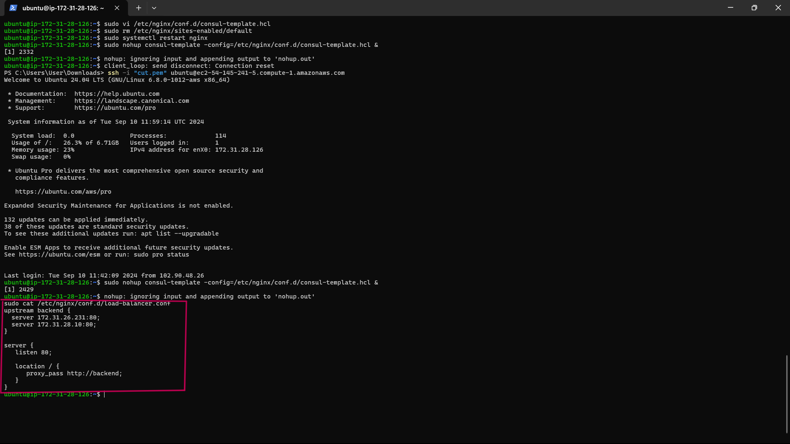

# Setup Service Discovery Using Nginx & Consul

# Checklist
 
 Task 1: Deploy 4 Ubuntu Server
 
 Task 2: Allow required ports in the security group
 
 Task 3: Set up architecture
 
 Task 4: Setup Consul Server
 
 Task 5: Setup Backend Servers
 
 Task 6: Setup Load-Balancer
 
 Task 7: Validate Service Discovery Setup

# Documentation

- After deploying 4 servers 

- click on the edit icon

- Name your Consul server, LoadBalancer server, and the two backend servers for easy identification.


## Allow Required Ports In The Security Group

- The Consul service requires specific ports to function correctly. Please open the following ports in your security group.

## Consul Servers 
|S/N | Port Name |Protocol | Default Port
|----|-----------|---------|-------|
|1	|DNS |	TCP and UDP |8600|
|2  |	HTTP API|	TCP	|8500|
|3|	HTTPS API|	TCP|8501|
|4|	gRPC| TCP| 8502|
|5|	gRPC TLS|	TCP|8503|
|6|	Server RPC|	TCP|8300|
|7|	LAN Serf|TCP and UDP| 8301|
|8|	WAN Serf| TCP and UDP|8302|

- Select the checkbox next to your instance, click on Security, and then click on the security group ID.


- Click on Edit inbound rules.


- Click on Add rule.


- Enter the Port range and choose the correct CIDR block.


- Click on Add Rule to specify the port range for the UDP protocol and Click on the Type field and choose Custom UDP from the dropdown menu.


- Enter the Port range and choose the CIDR blocks.


- Verify that all the necessary ports are open.


- Click on Save rules to apply the updated security group settings.

### Setup Consul Server

- SSH into the consul server and run sudo apt update to refresh the package cache.

- Visit the consul downloads page to copy the installation command.



- Or execute the following commands to install Consul.

```
wget -O- https://apt.releases.hashicorp.com/gpg | gpg --dearmor | sudo tee /usr/share/keyrings/hashicorp-archive-keyring.gpg

echo "deb [signed-by=/usr/share/keyrings/hashicorp-archive-keyring.gpg] https://apt.releases.hashicorp.com $(lsb_release -cs) main" | sudo tee /etc/apt/sources.list.d/hashicorp.list

sudo apt update && sudo apt install consul
```


- Confirm Consul installation by checking its version with the consul --version command.


-All the Consul server configurations are located in the **/etc/consul.d** folder. To configure the Consul server, start by backing up the default configuration file consul.hcl by renaming it to **consul.hcl.back**, using the following command: **sudo mv /etc/consul.d/consul.hcl /etc/consul.d/consul.hcl.back**


- Generate an encrypted key using the **consul keygen** command.


- Create a new file named consul.hcl in the /etc/consul.d directory, using the following command: **sudo vi /etc/consul.d/consul.hcl**

- Add the following content to the consul.hcl file, replacing <YOUR_ENCRYPTED_KEY> with the encrypted key you generated:

```
"bind_addr" = "0.0.0.0"
"client_addr" = "0.0.0.0"
"data_dir" = "/var/consul"
"encrypt" = "<YOUR_ENCRYPTED_KEY>"
"datacenter" = "dc1"
"ui" = true
"server" = true
"log_level" = "INFO"
```


- Save this file after adding the content.

###  This is an explanation of each configuration setting in the Consul configuration file:

**bind_addr = "0.0.0.0"**: Specifies the IP address on which Consul will bind to listen for incoming connections. 0.0.0.0 means Consul will listen on all available network interfaces.

**client_addr = "0.0.0.0"**: Determines the IP address on which the Consul client API will be available. Setting it to 0.0.0.0 allows connections from any IP address.

**data_dir = "/var/consul"**: Specifies the directory where Consul will store its data, such as the state and logs.

**encrypt = "<YOUR_ENCRYPTED_KEY>"**: Sets the encryption key for securing communication between Consul servers and clients. Replace this placeholder with your actual generated encryption key.

**datacenter = "dc1"**: Defines the datacenter name that this Consul server will use. Consul uses datacenters to organize services and nodes.

**ui = true**: Enables the Consul Web UI. This provides a graphical interface for interacting with Consul's data.

**server = true**: Indicates that this instance is a Consul server. Server nodes participate in the consensus protocol and store the state of the system.

**log_level = "INFO"**: Sets the verbosity of the logs. **INFO** level provides a balance of details, logging general information, warnings, and errors.

- Run the following command to start the Consul server in the background: **sudo nohup consul agent -dev -config-dir /etc/consul.d/ &.**


- You can check the status of the Consul server with the following command: **consul members**.


- If you visit **EC2 Consul Server IP>:8500**, you should be able to access the Consul dashboard.


## Setup Backend Servers

Since we have the Consul server up and running, let's manage our Nginx backend servers more easily using service discovery. To do this, we'll install Nginx and the Consul agent on all the backend servers. The Consul agent acts like a messenger, automatically registering both the server and the Nginx service running on it with the Consul server, which acts like a central directory.

Apply the configurations below on both backend servers:

- SSH into the backend servers and run **sudo apt-get update -y** to update package information.




- Install Nginx on both instances by running the following command: **sudo apt install nginx -y**.


- Navigate to the HTML directory by executing the following command: cd /var/www/html.

- Open the HTML file with your preferred text editor to make edits: sudo vi index.html.

- Copy the HTML content below into the index.html file. On the second server, replace **SERVER-01** with **SERVER-02** in the HTML file to differentiate between the two backend servers.

```
<!DOCTYPE html>
<html>
<head>
	<title>Kanekis Backend Server </title>
</head>
<body>
	<h1>This is Backend SERVER-01</h1>
</body>
</html>
```


- Install Consul as an agent on the servers. Run the following commands to install Consul:

```
wget -O- https://apt.releases.hashicorp.com/gpg | gpg --dearmor | sudo tee /usr/share/keyrings/hashicorp-archive-keyring.gpg

echo "deb [signed-by=/usr/share/keyrings/hashicorp-archive-keyring.gpg] https://apt.releases.hashicorp.com $(lsb_release -cs) main" | sudo tee /etc/apt/sources.list.d/hashicorp.list

sudo apt update && sudo apt install consul
```


- Verify that Consul is installed properly by running the following command: consul --version.


- Replace the default Consul configuration file config.hcl located in /etc/consul.d with your custom consul.hcl file.

- Rename the default file and create a new one by running the following commands:

```
sudo mv /etc/consul.d/consul.hcl /etc/consul.d/consul.hcl.back
sudo vi /etc/consul.d/consul.hcl
```

- Add the following contents to the file. Replace **<YOUR_ENCRYPTED_KEY>** with your encryption key. Also, replace **3.214.46.105** with your Consul server's IP address.

```
"server" = false
"datacenter" = "dc1"
"data_dir" = "/var/consul"
"encrypt" = "<YOUR_ENCRYPTED_KEY>"
"log_level" = "INFO"
"enable_script_checks" = true
"enable_syslog" = true
"leave_on_terminate" = true
"start_join" = ["3.214.46.105"]
```



 ### This is an explanation of the Consul agent configuration settings:

**server = false:** Indicates that this node is not a Consul server, but a client (agent). A Consul server handles requests from other Consul agents, while a client node registers services and performs checks.

**datacenter = "dc1"**: Specifies the datacenter name where the Consul agent operates. This should match the datacenter configuration on the Consul server to ensure proper communication.

**data_dir = "/var/consul"**: Defines the directory where the Consul agent will store its data files. This directory must be writable by the Consul agent process.

**encrypt = "<YOUR_ENCRYPTED_KEY>"**: Provides the encryption key for securing communication between Consul agents and the Consul server. Replace <YOUR_ENCRYPTED_KEY> with the actual key generated using consul keygen.

**log_level = "INFO"**: Sets the verbosity of the log output. INFO level provides a balance between detail and readability, showing general information about Consul operations.

**enable_script_checks = true**: Enables the execution of script-based health checks. When set to true, the Consul agent can run custom scripts to check service health.

**enable_syslog =** true: Allows logging of Consul messages to the syslog service. When enabled, logs will be sent to the system's logging facility, which can be useful for centralized logging and monitoring.

**leave_on_terminate = true**: Ensures that the Consul agent will automatically deregister itself from the Consul server when the agent process is terminated. This helps maintain accurate service registration and avoids stale entries.

**start_join = ["3.214.46.105"]**: Lists the addresses of Consul servers or agents that this Consul client should contact when starting up to join the Consul cluster. Replace 34.201.77.72 with the IP address of your Consul server. This setting helps the agent locate and connect to the Consul server to begin registering services.

- Next, we need to create a backend.hcl configuration file in the /etc/consul.d directory to register the Nginx service and its health check URLs with the Consul server. This will enable the Consul server to continuously monitor the health of the Nginx service. Use the following command to create and edit the file: **sudo vi /etc/consul.d/backend.hcl**.

- Add the following contents to the **backend.hcl** file and save it.

```
"service" = {
  "Name" = "backend"
  "Port" = 80
  "check" = {
    "args" = ["curl", "localhost"]
    "interval" = "3s"
  }
}
```


 This configuration registers your backend servers with the Consul server and sets up a health check that uses curl to test the service every 3 seconds.

- Verify the configurations by executing the following command: **consul validate /etc/consul.d**.


- Once all configurations are complete, start the Consul agent with the following command: **sudo nohup consul agent -config-dir /etc/consul.d/ &.**


- To verify if everything is working correctly, visit your Consul UI. If you see the backend listed in the UI as depicted below, it indicates that the backend has successfully registered itself with Consul.


## Setup Load-Balancer

Set up the load balancer to automatically update its backend server information based on the service registry maintained by Consul. To retrieve the backend server details, we will use the **consul-template** binary. This tool interacts with the Consul server via API calls to fetch the backend server information. It then uses a template to substitute values and generate the **loadbalancer.conf** file, which is utilized by Nginx.

- Log in to the load-balancer server. Update the package information and install unzip with the following commands:

```
sudo apt-get update -y
sudo apt-get install unzip -y
```


- Install Nginx using the following command: sudo apt install nginx -y.


- Download the consul-template binary using the following command:

```
sudo curl -L  https://releases.hashicorp.com/consul-template/0.30.0/consul-template_0.30.0_linux_amd64.zip -o /opt/consul-template.zip

sudo unzip /opt/consul-template.zip -d  /usr/local/bin/
```


- To verify the installation of consul-template, check its version with the following command: **consul-template --version**.


- Create and edit a file named load-balancer.conf.ctmpl in the /etc/nginx/conf.d directory, using the following command: sudo vi /etc/nginx/conf.d/load-balancer.conf.ctmpl.

- Paste the following content into the file:

```
upstream backend {
 {{- range service "backend" }} 
  server {{ .Address }}:{{ .Port }}; 
 {{- end }} 
}

server {
   listen 80;

   location / {
      proxy_pass http://backend;
   }
}
```


## This is a breakdown of the configuration:

**1. Upstream Block**

```
upstream backend {
 {{- range service "backend" }} 
  server {{ .Address }}:{{ .Port }}; 
 {{- end }} 
}
```

- **upstream backend**: This defines a group of backend servers that Nginx can load-balance requests across.

- **{{- range service "backend" }}**: This is a Consul-Template directive that iterates over all services registered with Consul under the name "backend".

- **server {{ .Address }}:{{ .Port }};**: For each backend service, it adds an entry to the upstream block with the server's address and port.

- **{{- end }}**: Ends the iteration block.

**2. Server Block**

```
server {
   listen 80;

   location / {
      proxy_pass http://backend;
   }
}
```

**server**: Defines a virtual server that listens for incoming requests.

**listen 80**: Specifies that this server block will listen on port 80 (the default HTTP port).

- **location /**: Defines a location block for all requests to the root URL (/).

- **proxy_pass http://backend**: Forwards incoming requests to the upstream group named "backend" defined above. Nginx will use the addresses and ports listed in the upstream backend block to balance the requests.

- Create a file named **consul-template.hcl** in the **/etc/nginx/conf.d/** directory. This configuration file is used by consul-template to specify details about the Consul server IP and the destination path where the processed load-balancer.conf file will be saved.

- Use the following command to create and edit the file: **sudo vi /etc/nginx/conf.d/consul-template.hcl**.

- Add the following content to the file, replacing **<Consul Server IP**> with your Consul server's IP address. This configuration specifies the Consul server details, the path to the template file, the destination for the rendered Nginx configuration, and the command to reload Nginx after updating the configuration.

```
consul {
 address = "<Consul Server IP>:8500"

 retry {
   enabled  = true
   attempts = 12
   backoff  = "250ms"
 }
}
template {
 source      = "/etc/nginx/conf.d/load-balancer.conf.ctmpl"
 destination = "/etc/nginx/conf.d/load-balancer.conf"
 perms       = 0600
 command = "service nginx reload"
}
```


- Delete the default server configuration to disable it by running the following command: **sudo rm /etc/nginx/sites-enabled/default**.


- Restart Nginx to apply the changes by running the following command: sudo systemctl restart nginx.

- Once configurations are complete, start the Consul Template agent using the following command. It continuously monitors Consul for changes.

```
sudo nohup consul-template -config=/etc/nginx/conf.d/consul-template.hcl &
```


- Upon completion, a load-balancer.conf file will be created with backend server information populated from the Consul service registry.



if you access the load balancer IP in your web browser, it will display the custom HTML content from one of the backend servers. When you refresh the page, the load balancer will route your request to the other backend server, displaying its custom HTML content.


### Service Discovery Test

Now that everything is set up and running, i can test the configuration by observing what happens when you stop one of your backend servers.


Stop one of the backend servers. The Consul server will monitor the health of each registered service. Once a backend server is stopped, Consul will detect the server's unavailability and mark it as unhealthy. The health check for that server will fail, and it will be removed from the load balancer's active pool of servers.


As a result, the load balancer will only direct traffic to the remaining healthy backend servers. This ensures that your application continues to run smoothly without any disruption to users, demonstrating the effectiveness of your service discovery and health check configuration with Consul and Nginx.


- In order to stop load balancer run:
**sudo systemctl stop nginx** on ther server you want to stop.

- In order to restore load balancer run:
**sudo systemctl start nginx**.

### The End Of Project 5
