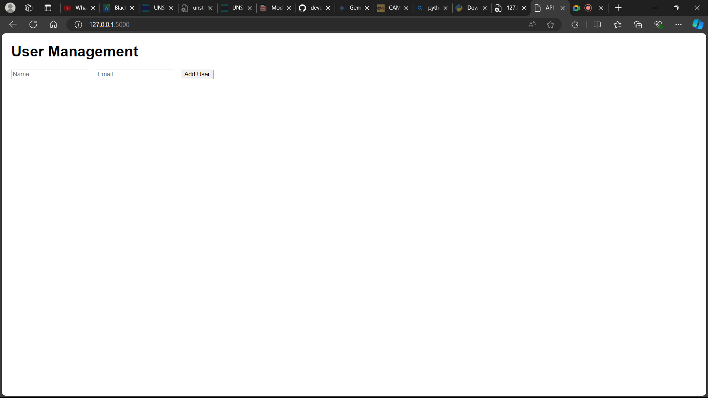

# Flask API Project

# Documentation

- Download and install python 


- Open vscode and install python through extentions.


**Note**: when installing python make sure it is also downloaded with paths, so it will work on vscodes.

## Running flask

- in Vscode, open a new terminal

- Click on git bash

- copy and paste in terminal

```
mkdir -p flask_api_project/{templates,static} && touch flask_api_project/app.py flask_api_project/templates/index.html flask_api_project/static/style.css && python -m venv flask_api_project/venv
```


- The Command above will create the project enviroment

- In the **app.py** file paste the code below


```
from flask import Flask, request, jsonify, render_template

app = Flask(__name__)

users = []

@app.route('/')
def home():
    return render_template('index.html')

@app.route('/users', methods=['POST'])
def create_user():
    user = request.get_json()
    users.append(user)
    return jsonify(user), 201

@app.route('/users', methods=['GET'])
def get_users():
    return jsonify(users), 200

@app.route('/users/<int:user_id>', methods=['GET'])
def get_user(user_id):
    user = next((u for u in users if u['id'] == user_id), None)
    return jsonify(user), 200 if user else 404

@app.route('/users/<int:user_id>', methods=['PUT'])
def update_user(user_id):
    user = request.get_json()
    index = next((i for i, u in enumerate(users) if u['id'] == user_id), None)
    if index is not None:
        users[index] = user
        return jsonify(user), 200
    return '', 404

@app.route('/users/<int:user_id>', methods=['DELETE'])
def delete_user(user_id):
    global users
    users = [u for u in users if u['id'] != user_id]
    return '', 204

if __name__ == '__main__':
    app.run(debug=True)
```

- In the **index.html** in the templates directory paste the code below:

```
<!DOCTYPE html>
<html lang="en">
<head>
    <meta charset="UTF-8">
    <meta name="viewport" content="width=device-width, initial-scale=1.0">
    <title>API-Based Application</title>
    <link rel="stylesheet" href="{{ url_for('static', filename='style.css') }}">
</head>
<body>
    <h1>User Management</h1>
    <form id="userForm">
        <input type="text" id="name" placeholder="Name" required>
        <input type="email" id="email" placeholder="Email" required>
        <button type="submit">Add User</button>
    </form>
    <ul id="userList"></ul>

    <script>
        document.getElementById('userForm').addEventListener('submit', async function (event) {
            event.preventDefault();
            const name = document.getElementById('name').value;
            const email = document.getElementById('email').value;
            
            const response = await fetch('/users', {
                method: 'POST',
                headers: {
                    'Content-Type': 'application/json'
                },
                body: JSON.stringify({ name, email })
            });

            const user = await response.json();
            document.getElementById('userList').innerHTML += `<li>${user.name} (${user.email})</li>`;
        });
    </script>
</body>
</html>
```


- In the **style.css** in the static directory paste this code below there:

```
body {
    font-family: Arial, sans-serif;
    margin: 20px;
}

form {
    margin-bottom: 20px;
}

input {
    margin-right: 10px;
}
```


- in the terminal paste the command:

```
python -m venv venv
source venv/Scripts/activate
pip install Flask
```

Run these commands:
- **pwd**

- **cd flask_api_project**

- **export flask_app=app.py** 

- **Flask run**


- Open your browser and go to **http://127.0.0.1:5000** to see your application.




## Postman

- Create a new request.

- Set the request type to POST and enter http://127.0.0.1:5000/users.


- Go to the Body tab, select raw, and choose JSON from the dropdown.

- Enter the JSON data:

```
{
    "name": "your name",
    "email": "yourname@example.com"
}
```

- Click Send and check the response.


# The End.
