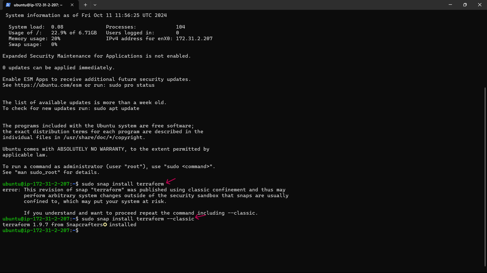
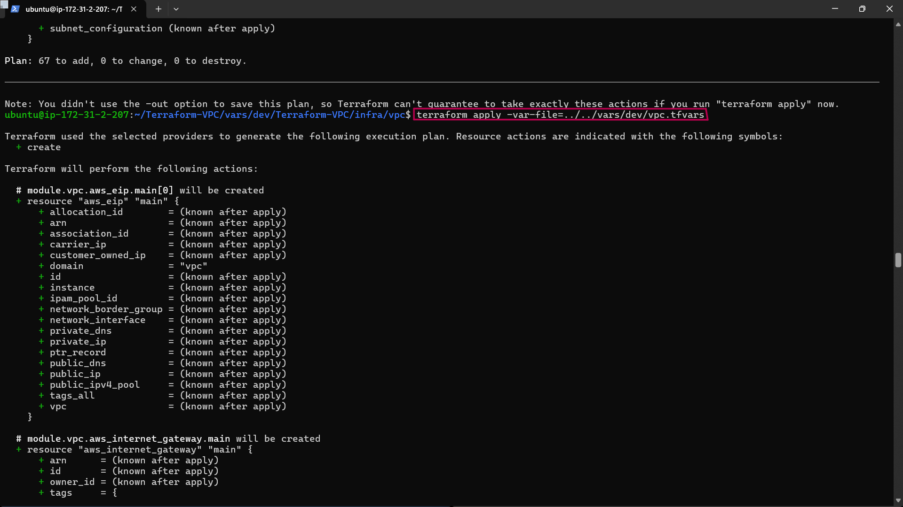

# AWS VPC using Terraform

## Documentation

- The first step to follow is to spin up an Ec2 instance to ensue you have a valid IAM role attached to the instance with VPC provisisoning permissions

- click on Roles, which is under IAM.

- Click on Create role


- Type VPC and select AmazonVPCFullAccess, do the same for EC2 and click next 


- Go back to EC2 instance that was created before

- Let us attach the role created earlier to the instance


#### Connect to your instance via ssh

- After connecting instance install terraform

```
sudo snap install terraform --classic
```



#### Terraform AWS VPC Creation Workflow

We will be creating the VPC with the following

- CIDR Block: 10.0.0.0/16

- Region: us-west-2

- Availability Zones: us-west-2a, us-west-2b, us-west-2c

- Subnets: 15 Subnets (One per availability Zone)

- Public Sunets (3)

- App Subets (3)

- DB Subnets (3)

- Management Subnet (3)

- Platform Subnet (3)

- NAT Gateway for Private subnets

- Internet Gateway for public subnets.

**Step 1**:
- Clone the repo into the instance

```
git clone https://github.com/TobiOlajumoke/Terraform-VPC.git
```


- Then cd in to the Terraform-VPC folder

```
cd Terraform-VPC
```


The VPC terraform code is structured in the following way.

```

├── infra
│   └── vpc
│       ├── main.tf
│       └── variables.tf
├── modules
│   └── vpc
│       ├── endpoint.tf
│       ├── internet-gateway.tf
│       ├── nacl.tf
│       ├── nat-gateway.tf
│       ├── outputs.tf
│       ├── route-tables.tf
│       ├── subnet.tf
│       ├── variables.tf
│       └── vpc.tf
└── vars
    └── dev
        └── vpc.tfvars
```

- vars folder contains the variables file named vpc.tfvars. and It is only this  file that needs modification

The modules/vpc folder contains the following VPC related resources. All the resource provisioning logic is part of these resources.

endpoint
internet-gateway
nacl
nat-gateway
route-tables
subnet
vpc The infra/vpc/main.tf file calls all the vpc module with all the VPC resources using the variables we pass using the vpc.tfvars file

**Step 2**:

Run the command 

```
Nano vars/dev/vpc.tfvars
```

This is what will be shown aftering running the command

```
#vpc
region               = "us-west-2"
vpc_cidr_block       = "10.0.0.0/16"
instance_tenancy     = "default"
enable_dns_support   = true
enable_dns_hostnames = true

#elastic ip
domain = "vpc"

#nat-gateway
create_nat_gateway = true

#route-table
destination_cidr_block = "0.0.0.0/0"

#tags
owner       = "DevOps"
environment = "dev"
cost_center = "DevOps-commerce"
application = "OpsApp"

#subnet

map_public_ip_on_launch       = true

public_subnet_cidr_blocks     = ["10.0.1.0/24", "10.0.2.0/24", "10.0.3.0/24"]
app_subnet_cidr_blocks        = ["10.0.4.0/24", "10.0.5.0/24", "10.0.6.0/24"]
db_subnet_cidr_blocks         = ["10.0.7.0/24", "10.0.8.0/24", "10.0.9.0/24"]
management_subnet_cidr_blocks = ["10.0.10.0/24", "10.0.11.0/24", "10.0.12.0/24"]
platform_subnet_cidr_blocks   = ["10.0.13.0/24", "10.0.14.0/24", "10.0.15.0/24"]
availability_zones            = ["us-west-2a", "us-west-2b", "us-west-2c"]

#public nacl

ingress_public_nacl_rule_no    = [100]
ingress_public_nacl_action     = ["allow"]
ingress_public_nacl_from_port  = [0]
ingress_public_nacl_to_port    = [0]
ingress_public_nacl_protocol   = ["-1"]
ingress_public_nacl_cidr_block = ["0.0.0.0/0"]

egress_public_nacl_rule_no    = [200]
egress_public_nacl_action     = ["allow"]
egress_public_nacl_from_port  = [0]
egress_public_nacl_to_port    = [0]
egress_public_nacl_protocol   = ["-1"]
egress_public_nacl_cidr_block = ["0.0.0.0/0"]

#app nacl

ingress_app_nacl_rule_no    = [100]
ingress_app_nacl_action     = ["allow"]
ingress_app_nacl_from_port  = [0]
ingress_app_nacl_to_port    = [0]
ingress_app_nacl_protocol   = ["-1"]
ingress_app_nacl_cidr_block = ["0.0.0.0/0"]

egress_app_nacl_rule_no    = [200]
egress_app_nacl_action     = ["allow"]
egress_app_nacl_from_port  = [0]
egress_app_nacl_to_port    = [0]
egress_app_nacl_protocol   = ["-1"]
egress_app_nacl_cidr_block = ["0.0.0.0/0"]

##db nacl

ingress_db_nacl_rule_no    = [100]
ingress_db_nacl_action     = ["allow"]
ingress_db_nacl_from_port  = [0]
ingress_db_nacl_to_port    = [0]
ingress_db_nacl_protocol   = ["-1"]
ingress_db_nacl_cidr_block = ["0.0.0.0/0"]

egress_db_nacl_rule_no    = [200]
egress_db_nacl_action     = ["allow"]
egress_db_nacl_from_port  = [0]
egress_db_nacl_to_port    = [0]
egress_db_nacl_protocol   = ["-1"]
egress_db_nacl_cidr_block = ["0.0.0.0/0"]

##management nacl

ingress_management_nacl_rule_no    = [100]
ingress_management_nacl_action     = ["allow"]
ingress_management_nacl_from_port  = [0]
ingress_management_nacl_to_port    = [0]
ingress_management_nacl_protocol   = ["-1"]
ingress_management_nacl_cidr_block = ["0.0.0.0/0"]

egress_management_nacl_rule_no    = [200]
egress_management_nacl_action     = ["allow"]
egress_management_nacl_from_port  = [0]
egress_management_nacl_to_port    = [0]
egress_management_nacl_protocol   = ["-1"]
egress_management_nacl_cidr_block = ["0.0.0.0/0"]

#platform nacl

ingress_platform_nacl_rule_no    = [100]
ingress_platform_nacl_action     = ["allow"]
ingress_platform_nacl_from_port  = [0]
ingress_platform_nacl_to_port    = [0]
ingress_platform_nacl_protocol   = ["-1"]
ingress_platform_nacl_cidr_block = ["0.0.0.0/0"]

egress_platform_nacl_rule_no    = [200]
egress_platform_nacl_action     = ["allow"]
egress_platform_nacl_from_port  = [0]
egress_platform_nacl_to_port    = [0]
egress_platform_nacl_protocol   = ["-1"]
egress_platform_nacl_cidr_block = ["0.0.0.0/0"]

#endpoint

create_s3_endpoint              = true
create_secrets_manager_endpoint = true
create_cloudwatch_logs_endpoint = true
```

- in this command edit owner and change it to the name of your choice

- Now cd in to infra/vpc folder and execute the terraform plan to validate the configurations.

```
cd infra/vpc
```


This command is used to change into the directory where your Terraform files for creating the VPC are located. In this case, you're moving into the infra/vpc directory.

- Firstly initialize Terraform

```
terraform init
```


This step is necessary to set up Terraform for the project. It will download any plugins (like AWS) Terraform needs and prepare your project. You only need to do this once when you start working with Terraform in a new directory.

- Execute the plan

```
terraform plan -var-file=../../vars/dev/vpc.tfvars
```


**Step 3**:

Lets create the VPC and related resources using terraform apply.

```
terraform apply -var-file=../../vars/dev/vpc.tfvars
```



**Step 4**:

- Validate VPC

 - Head over to the AWS Console the check the Resource Map of the VPC.

- Click on the created VPC and scroll down to view the Resource Map.

- You should see 15 subnets , 6 route tables, internet gateway and NAT gateway as shown below.


**Step 5**:

- Clean up the resources created by Terraform, execute the following command


# The End.
