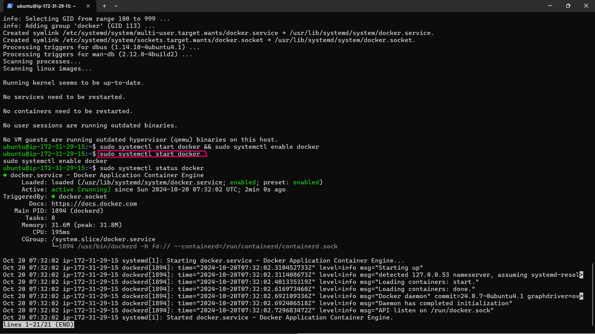
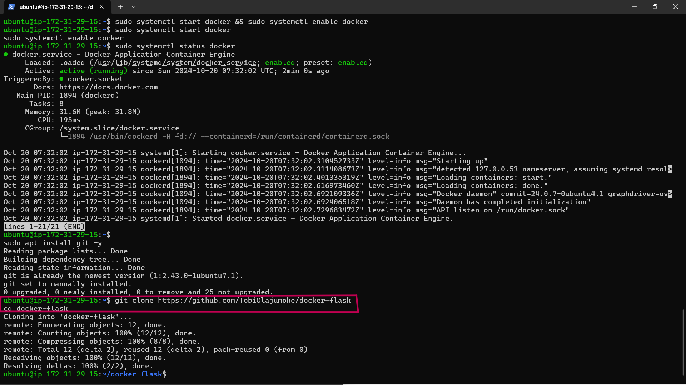

# Dockers

# Documentation

- Firstly Spin up an Ubuntu 24.04 t2.micro,connect SSH into the instance

- Then install and start docker

- Update your package index:

```
sudo apt update
```


- Install Docker:

```
sudo apt install docker.io -y
```


- Start Docker:

```
sudo systemctl start docker
sudo systemctl enable docker
```


- Check the Status of Docker:

```
sudo systemctl status docker
```



**NOTE**: ctrl + c to exit the running docker

####  Clone the Docker Project

- Install Git (if not installed):

```

sudo apt install git -y 
```


- Clone the project repository:

```
git clone https://github.com/TobiOlajumoke/docker-flask
cd docker-flask
```



- The docker file

```
cat dockerfile
```


break down of the Dockerfile step by step:

1. ARG PYTHON_VERSION=3.11.6

Explanation: This defines a build-time variable (ARG) that specifies the version of Python to use. Here, it’s set to Python 3.11.6.

Why it's useful: By using an argument, you can easily change the Python version later without altering multiple lines in your Dockerfile. It also makes the Dockerfile more flexible.

2. FROM python:${PYTHON_VERSION}-slim as base

Explanation: This tells Docker to use the official Python image (specifically, a slim version of it) as the base image. The slim variant of the Python image is a lightweight version that contains only the essentials for Python.

Why it's useful: Slim images are smaller and faster to download. This improves efficiency in building and running containers.

3. ENV PYTHONDONTWRITEBYTECODE=1

Explanation: This environment variable prevents Python from writing .pyc files (compiled bytecode files).

Why it's useful: By avoiding the creation of bytecode files, you reduce unnecessary writes to the filesystem, which can be especially helpful in container environments where efficiency is key.

4. ENV PYTHONUNBUFFERED=1

Explanation: This environment variable ensures that Python output is displayed directly to the terminal without buffering.

Why it's useful: In a container environment, you often want logs and outputs to be available immediately for monitoring purposes, so unbuffered output is preferred.

5. WORKDIR /app
Explanation: This sets the working directory inside the container to /app. All subsequent commands in the Dockerfile will run from this directory.

Why it's useful: This isolates the app's code and dependencies inside a specific folder, making it easier to organize.

6. ARG UID=10001
Explanation: This defines a build-time variable to specify the user ID for the application user (appuser), set to 10001 by default.

Why it's useful: By specifying a user ID, you improve security by running the application under a non-root user, which minimizes the risk in case of a container breach.

7. RUN adduser ... appuser

Explanation: This creates a new user (appuser) with the specified user ID, but without a password, home directory, or shell access.

Why it's useful: Running processes inside the container as a non-root user (appuser) is a best practice for security reasons, as it limits the damage that could be done by a malicious user.

8. COPY requirements.txt .

Explanation: This copies the requirements.txt file (which lists Python dependencies) from your local machine into the container’s /app directory.

Why it's useful: This file is required to install the necessary dependencies for the Python application.
9. RUN python -m pip install -r requirements.txt

Explanation: This command installs all the dependencies listed in requirements.txt using Python’s package manager (pip).

Why it's useful: This ensures that all required Python libraries are installed inside the container, making the app self-contained.

10. USER appuser
Explanation: This switches the container's user to appuser (the non-root user we created earlier).

Why it's useful: Running the app as a non-root user enhances security by limiting the scope of what can be accessed within the container.

11. COPY . .

Explanation: This copies all the files from the current directory on your local machine into the /app directory inside the container.

Why it's useful: This is how the rest of your application code gets into the container.

12. EXPOSE 8000

Explanation: This informs Docker (and anyone using the image) that the container will listen for network requests on port 8000.

Why it's useful: This is necessary to expose the correct port to the outside world when running the container.

13. CMD ["gunicorn", "--bind", "0.0.0.0:8000", "hello:app"]

Explanation: This is the command that runs when the container starts. It launches your Python web application using Gunicorn, which is a WSGI server for Python web apps.

--bind 0.0.0.0:8000: Tells Gunicorn to bind the app to all network interfaces on port 8000, making it accessible.

hello:app: This specifies the Python module (hello) and the WSGI application instance (app) to run. It assumes your Python application file is named hello.py and it contains a variable app that represents your Flask application.

#### Run the Docker Application

- Build the Docker Image:

```
sudo docker build -t flask-application:1.0.0 .
```


- Check if the image built

```
Check if the image built
```


- Run the Docker Container:

```
sudo docker run -d -p 8000:8000 flask-application:1.0.0
```


Check if the container is running if it is PROCEED to 3

```
sudo docker ps
```


#### if the container isn't running check the list of all containers

```
sudo docker ps -a
```

NOTE: To troubleshoot or find out why the container "exited" and isn't running you'll check the container logs by running this command
Test in Browser Now, go to your browser and access your EC2 public IP to check if the app is running properly:

- The webpage will not work, WHY?
we have not added the port 8000 to our security group of our instance so do that and try accessing the EC2 public IP

The webpage will not work, WHY?

we have not added the port 8000 to our security group of our instance so do that and try accessing the EC2 public IP


#### push the image to docker hub

After successfully building and running your Docker image, you may want to share it with others or deploy it to different environments. Docker Hub is a cloud-based registry service that allows you to store and distribute Docker images.

-  Create a Docker Hub Account if you dont have one

- Create a repo


#### Log In to Docker Hub from Your Terminal

```
sudo docker login
```


You will be prompted to enter your Docker Hub username and password.

- Before pushing the image, you need to tag it with your Docker Hub username and a repository name. The tagging format is:

```
<your-dockerhub-username>/<repository-name>:<tag>
```


#### Push the Image to Docker Hub

- Once your image is tagged, you can push it to Docker Hub using the following command:

```
docker push yourusername/flask-application:1.0.0
```


#### Verify the Push

- After the push completes, you can verify that your image is on Docker Hub by visiting your Docker Hub profile and checking the repositories.


Why Push to Docker Hub?
Collaboration: Team members can easily access shared images without having to build them from scratch.
Backup: Storing images on Docker Hub acts as a backup, ensuring that you can recover or roll back to previous versions if needed.
Deployment: You can pull images directly from Docker Hub in different environments, simplifying the deployment process.

# The End.
